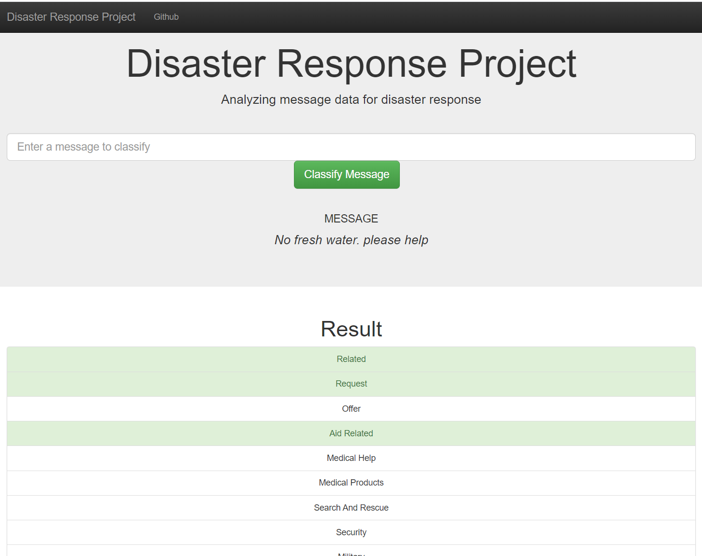

# Disaster Response Project

## Building Machine Learning model to classify text messages

### Overview

This is an End-to-End Machine Learning project. Using disaster text message data, I built a ML model for an API that classifies the text messages into several categories. This project involves building ETL process, modeling ML classifer, and developing a Flask Web app.

I used to the Notebooks to find/optimize the model used in the train_classifier.py file 
Currently, the model is using RandomForestClassifier object for multi output.

When a user type a text message, the model will output multiple tags related to the message. The outut tags will be highlighted in the web app as shown below.

Data Source: Figure Eight

### Components

1. ETL Pipeline : a data cleaning pipeline that:

 * Loads the messages and categories datasets
 * Merges the two datasets
 * Cleans the data
 * Stores it in a SQLite database

2. ML Pipeline train_classifiery.py : a machine learning pipeline that:

 * Loads data from the SQLite database
 * Splits the dataset into training and test sets
 * Builds a text processing and machine learning pipeline
 * Trains and tunes a model using GridSearchCV
 * Outputs results on the test set
 * Exports the final model as a pickle file

3. Flask Web App

### Instructions:
1. Run the following commands in the project's root directory to set up your database and model.

    - To run ETL pipeline that cleans data and stores in database
        `python data/process_data.py data/disaster_messages.csv data/disaster_categories.csv data/disaster_message.db`
    - To run ML pipeline that trains classifier and saves
        `python models/train_classifier.py data/disaster_message.db models/classifier.pkl`

2. Run the following command in the app's directory to run your web app.
    `python run.py`

3. Go to http://0.0.0.0:3001/ or http://localhost:3001